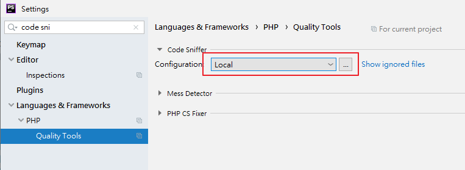
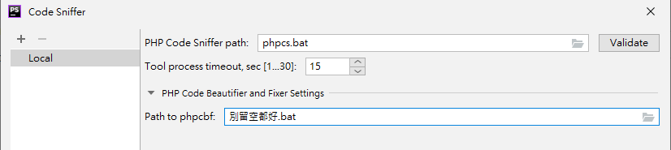
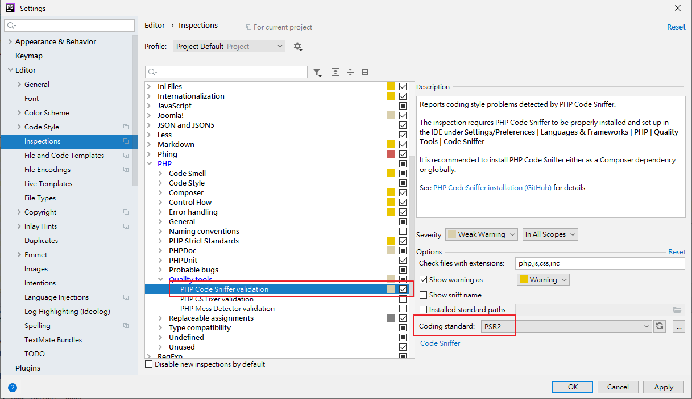
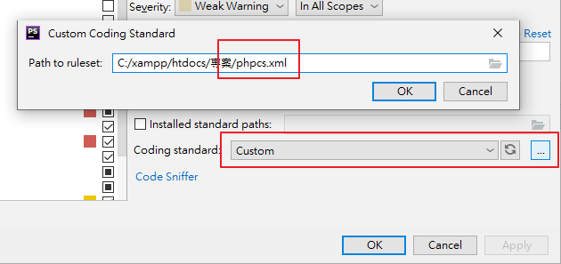

# 安裝
1. 安裝 PHP_CodeSniffer （推薦使用 Composer 進行安裝）  
[https://github.com/squizlabs/PHP_CodeSniffer](https://github.com/squizlabs/PHP_CodeSniffer)
    ```bash
    composer global require "squizlabs/php_codesniffer=*"
    ```

2. 確認指令可用
    ```bash
    phpcs --version
    phpcbf --version
    ```

# 使用 phpcs
檢查錯誤
```basah
phpcs <檔案/資料夾>
```

自動修正錯誤
```bash
phpcbf <檔案/資料夾>
```

# 自訂驗證標準
使用 phpcs 時，可自訂驗證使用標準（如：PSR-2，或[自己撰寫的定義檔](https://github.com/squizlabs/PHP_CodeSniffer/wiki/Annotated-Ruleset)等）
若未指定，將預設嘗試抓取 `phpcs.xml` 作為標準
```bash
phpcs --standard=PSR2
phpcs --standard=/path/to/custom_ruleset.xml
```

# 於 PhpStorm 使用 phpcs
設定 Code Sniffier  
`Settings` → `Languages & Frameworks` → `PHP` → `Quality Tools` → `Code Sniffier`
Configuration 設定為 Local，點擊右側「…」  


PHP Code Sniffier path 設定為「phpcs.bat」（無須指定路徑），點擊 `Validate` 進行驗證，確認抓到全域 `phpcs` 指令  
Path to phpcbf 填入任意字串，只要不是空白的，PhpStorm 就會自動去抓全域的 `phpcbf`  
（這種設定方式會使得無法使用 `Validate` 進行驗證，但不影響使用）  


`Settings` → `Editor` → `Inspections` → `PHP` → `Quality Tools` → `PHP Code Sniffier validation`  
勾選後即可啟用，亦可指定驗證標準  


將 `Coding standard` 指定為 `Custom`  
並點擊「…」將 `Path to ruleset` 指向專案資料夾的 `phpcs.xml`  
（PhpStorm 不會自動去使用該檔案作為標準，須自行指定）


完成後，PhpStorm 便會依自己提供的 phpcs.xml 對專案中的程式碼進行驗證

# 參考資料
- [https://github.com/squizlabs/PHP_CodeSniffer](https://github.com/squizlabs/PHP_CodeSniffer)
- [PHP Code Sniffer – Help | PhpStorm](https://www.jetbrains.com/help/phpstorm/using-php-code-sniffer.html)
- [調整程式碼風格（Coding Style）](https://ithelp.ithome.com.tw/articles/10195490)
