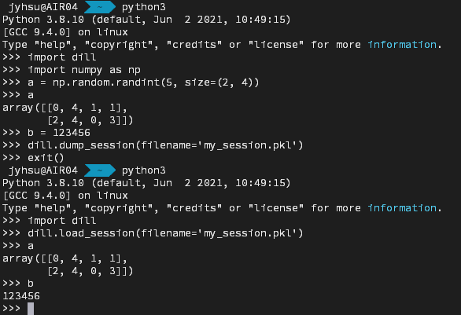

## 前言
在使用 Python 直譯器或 Jupyter 等工具進行測試時，有時會希望能將變數保留下來，  
通常我們會將變數逐一保存為 `pickle`（`*.pkl`）檔案，  
但若須保存的變數較多，或希望保存整個 Session 的所有變數，如此操作卻會相當麻煩，  
因此，能夠保存整個 Session 的 dill 套件或許會成為一個更好的選擇。

## 介紹
dill 可將常見型態的 Python 變數透過序列化的方式保存於 Pickle 檔案，  
並透過反序列化的方式由 Pickle 檔案取回變數到 Session 中。

相較於其他序列化／反序列化套件，dill 還可以直接將 Session 中的所有變數進行上述動作。

## 安裝
直接使用 pip 直接進行套件安裝即可
```bash
pip3 install dill
```

## 保存 Session
```python
import dill
dill.dump_session(filename='path/to/session.pkl')
```

## 載入 Session
```python
import dill
dill.load_session(filename='path/to/session.pkl')
```

## 注意
若不指定 `filename` 參數，將預設為暫存資料夾中的 `/tmp/session.pkl`，  
如欲長久保留，或欲區分多個 Session 的變數，建議自行指定檔案路徑

## 實際測試
嘗試建立變數，並透過 dill 保存 Session，  
重開一個 Session 後，透過 dill 載入被保存的 Session


## 參考資料
- [pickle — Python object serialization — Python 3 documentation](https://docs.python.org/3/library/pickle.html)
- [dill · PyPI](https://pypi.org/project/dill/)
