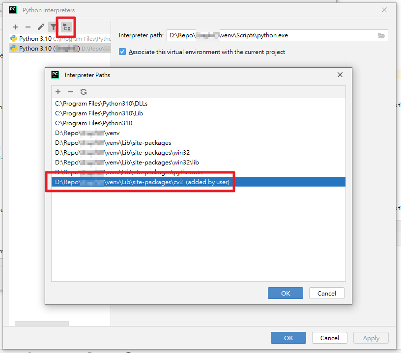

## 前言
在 PyCharm 中，  
若使用較新版本的 OpenCV（>= 4.6），  
會發現 OpenCV 的自動完成功能無法正常運作，  
程式碼對於 `cv2` 的靜態檢查亦會提示錯誤。

[該問題](https://youtrack.jetbrains.com/issue/PY-54649)在 JetBrains 的 YouTrack 上已經被提出許久，  
但目前 JetBrains 與 OpenCV 雙方都未直接解決此問題。

這邊提供幾種應急解決方案。

## 解決方案

### 方案 1 - 使用舊版 OpenCV
直接逃避問題，將 OpenCV 指定使用 4.5 當中的最新版本
```
opencv-python==4.5.5.62
```

### 方案 2 - 修改直譯器設定，使其能夠識別 `cv2`
透過以下方式，使 PyCharm 能夠正確識別 `cv2` 套件的界面
1. 開啟直譯器設定：`File` → `Settings...` → `Project: <專案名稱>` → `Project Interpreter`
2. 點擊 `Project Interpreter` 的下拉選單，選擇 `Show All...`
3. 選擇當前使用之直譯器，點擊上方 `Show Interpreter Paths` 圖示按鈕
4. 點擊 `Add` 按鈕，新增一個路徑，路徑為 `cv2` 套件的安裝路徑
    - 例如：使用 `venv`，則將 `venv/Lib/site-packages/cv2` 新增至其中
5. 點擊 `OK` 按鈕，完成設定，即可正常使用 OpenCV 的自動完成功能




## 參考資料
- [OpenCV code completion is (still!) not working : PY-54649](https://youtrack.jetbrains.com/issue/PY-54649)
- [python - opencv autocomplete not working on pycharm - Stack Overflow](https://stackoverflow.com/questions/73174194/opencv-autocomplete-not-working-on-pycharm)
